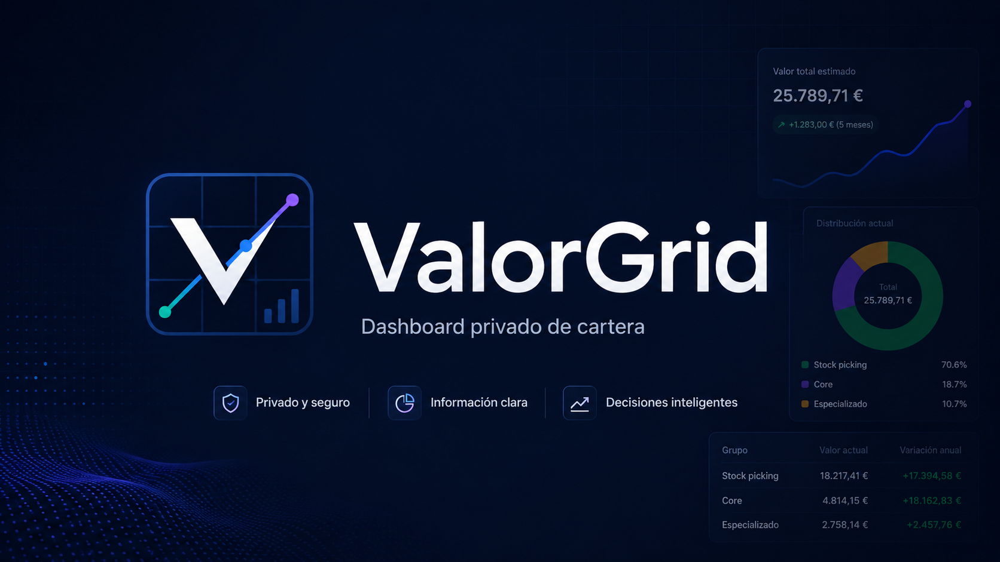
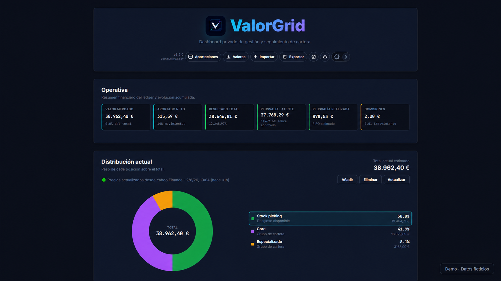
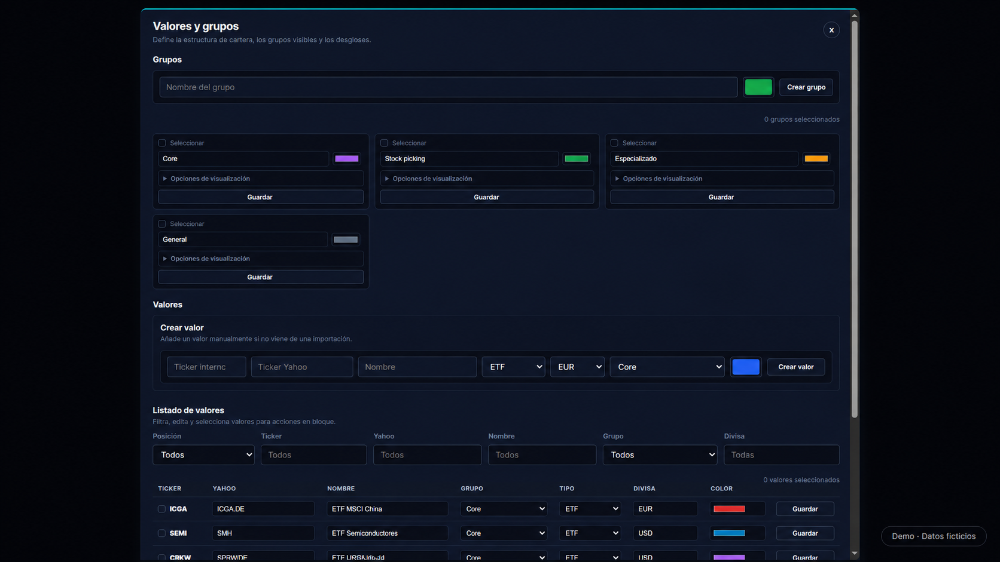
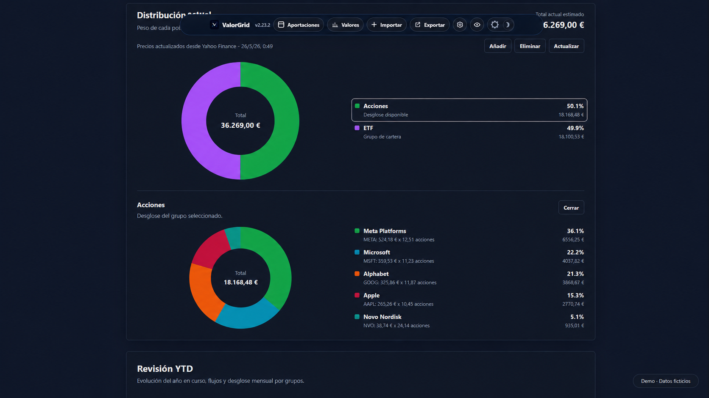
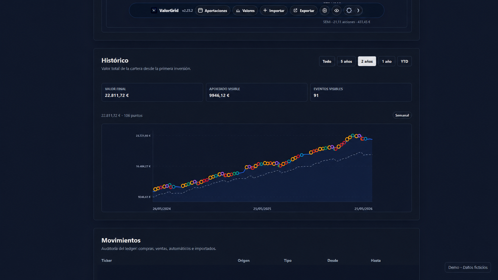
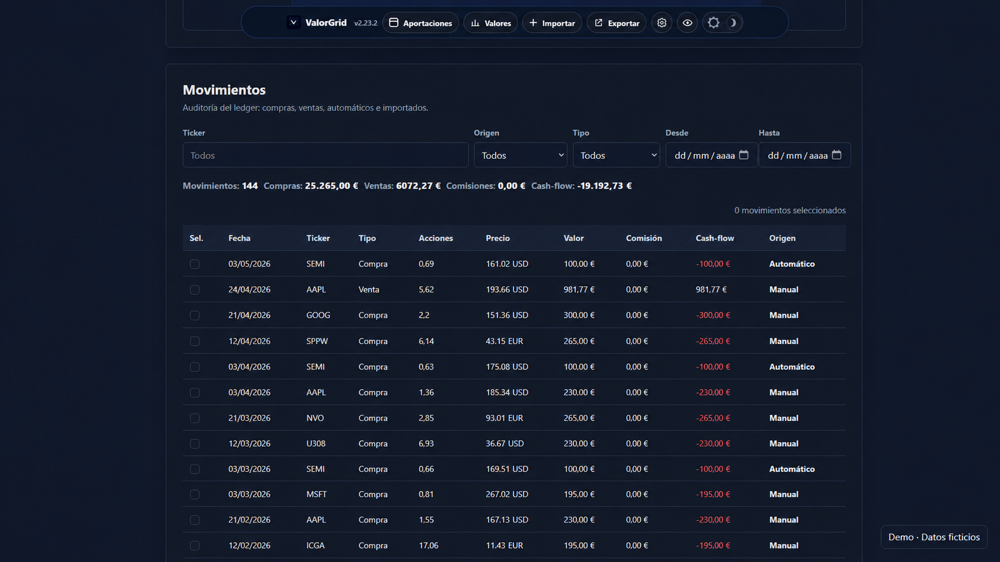

# ValorGrid


[](#apoyar-el-proyecto)



ValorGrid es una aplicación local de un solo usuario para gestionar y visualizar una cartera privada con SQLite.

Está pensada como una herramienta de seguimiento, organización y visualización de cartera. No ofrece asesoramiento financiero, recomendaciones de inversión ni señales de compra o venta.

## Funcionalidades principales

- Dashboard de distribución actual de cartera.
- Revisión YTD de evolución, flujos y resultado anual.
- Registro de movimientos de compra y venta.
- Importación mediante plantilla Excel oficial de ValorGrid con preview, conciliación y rollback.
- Histórico de evolución de cartera.
- Aportaciones automáticas configurables.
- Backups locales y exportación Excel de movimientos.
- Ejecución local con datos bajo control del usuario.

## Privacidad

ValorGrid se ejecuta en local. La app escucha por defecto en `127.0.0.1`, no requiere login y no sincroniza datos con servidores externos.

El repositorio no debe contener datos reales de cartera. Las bases SQLite, backups, configuración local y archivos de importación del usuario están ignorados por Git.

```text
código del repositorio
data/portfolio.sqlite      privado e ignorado
.backups/                  privado e ignorado
.env                       privado e ignorado
```

Yahoo Finance se usa solo como proveedor externo de precios. Los resultados se cachean localmente en SQLite.

Más detalle en [docs/PRIVACY_SECURITY.md](docs/PRIVACY_SECURITY.md).

## Instalar en Windows

La ruta recomendada para usuarios no tecnicos es el instalador de GitHub Releases:

1. Abrir la ultima release en GitHub.
2. Descargar `ValorGrid-Setup-X.Y.Z-x64.exe`.
3. Descargar `SHA256SUMS.txt` y comprobar el checksum si se quiere verificar el artefacto.
4. Ejecutar el instalador y abrir ValorGrid desde el menu Inicio.

La version de escritorio incluye el runtime necesario. No requiere instalar Node.js ni ejecutar comandos. La base SQLite y los backups se guardan en la carpeta privada de datos de la aplicacion del usuario, fuera del directorio instalado.

La guia de publicacion y rollback esta en [docs/GITHUB_RELEASE.md](docs/GITHUB_RELEASE.md).

## Reconstruir el instalador Windows en local

Desde la raiz del repositorio:

```powershell
powershell -ExecutionPolicy Bypass -File .\scripts\build-desktop-win.ps1
```

El script limpia `dist/`, ejecuta el build Electron/NSIS y regenera `dist/SHA256SUMS.txt`.

## Requisitos

Estos requisitos aplican solo al desarrollo local desde el repositorio:

- Node.js 24 o superior, por el uso de `node:sqlite`.
- PowerShell para los scripts `.ps1` incluidos.

Instala dependencias:

```powershell
npm install
```

## Ejecutar en local

```powershell
npm start
```

Después abre:

```text
http://localhost:5173
```

Equivalente manual:

```powershell
node server.js
```

La ruta de base de datos se decide así:

1. `PORTFOLIO_DB_PATH`, si está definido.
2. `portfolio.sqlite` en la raíz, si existe por compatibilidad con instalaciones antiguas.
3. `data/portfolio.sqlite` para instalaciones nuevas.

Ejemplo con ruta privada explícita:

```powershell
$env:PORTFOLIO_DB_PATH = "D:\cartera-privada\portfolio.sqlite"
node server.js
```

## Dataset demo

El dataset demo/loadtest es sintético, determinista y canónico (una sola fuente en `scripts/loadtest-data.js`). No representa una cartera real.

```powershell
npm run seed:demo
$env:PORTFOLIO_DB_PATH = ".\portfolio.loadtest.sqlite"
node server.js
```

También puedes usar:

```powershell
powershell -ExecutionPolicy Bypass -File .\scripts\start-loadtest.ps1
```

`portfolio.loadtest.sqlite` es regenerable y no debe versionarse.

`seed:demo` es el único comando soportado para poblar la demo.

## Importaciones

ValorGrid Community solo acepta la plantilla Excel oficial de ValorGrid. Descargala desde la app o desde:

```text
GET /api/import/template.xlsx
```

Un ejemplo sintético con tickers reales del S&P 500 está disponible en `samples/valorgrid-template/`. Los datos de movimientos son ficticios y no representan una cartera real.

Los conectores avanzados de broker pertenecen a ValorGrid Pro/Enterprise. ValorGrid Community no publica código, contratos operativos ni muestras privadas de esas integraciones.

## Exportaciones

La app exporta movimientos en el mismo formato Excel que acepta el importador:

```text
GET /api/export/transactions.xlsx
```

El archivo contiene una sola hoja `Movimientos`, sin instrucciones ni ejemplos, lista para auditoría o reimportación.

## Docker

ValorGrid puede ejecutarse como servicio local con Docker:

```bash
docker compose up -d --build
```

La base SQLite queda en `./data` y los backups en `./backups`, ambas rutas privadas e ignoradas por Git.

La guía completa está en [docs/DEPLOY_DOCKER.md](docs/DEPLOY_DOCKER.md).

## Tests

```powershell
npm test
```

Checks completos de CI local:

```powershell
npm run typecheck
npm run lint
npm run format:check
npm test
```

La suite incluye comprobaciones de privacidad para evitar publicar rutas locales, bases SQLite, backups o saldos iniciales personales en código.

## Verificar antes de publicar

Antes de crear un commit o publicar en GitHub:

```powershell
npm run verify:publication
```

Ese comando ejecuta checks de sintaxis, tests y validaciones de privacidad sobre los archivos publicables.

Antes de publicar una release, revisa [docs/GITHUB_RELEASE.md](docs/GITHUB_RELEASE.md).

## Backups

Crear backup local:

```powershell
npm run db:backup
```

Diagnóstico rápido de DB:

```powershell
npm run db:doctor
```

Reset fresh (destructivo, con confirmación):

```powershell
npm run db:reset
```

También sigue disponible backup por API local con:

```text
POST /api/backups
```

Los backups se guardan en `.backups/`, que no debe subirse a Git.
La app conserva automaticamente los 6 backups mas recientes.

Flujo completo en [docs/DB_OPERATIONS.md](docs/DB_OPERATIONS.md).

## Capturas

### Dashboard principal


### Instrumentos y grupos


### Distribución


### Histórico


### Movimientos


## Documentación útil

- [docs/API.md](docs/API.md): endpoints de la API local.
- [docs/DATA_MODEL.md](docs/DATA_MODEL.md): tablas principales y modelo SQLite.
- [docs/ARCHITECTURE.md](docs/ARCHITECTURE.md): backend, frontend, histórico e importaciones.
- [docs/EDITIONS.md](docs/EDITIONS.md): separacion Community / Pro-Enterprise y frontera de repositorios.
- [docs/DEPLOY_DOCKER.md](docs/DEPLOY_DOCKER.md): despliegue local con Docker y CasaOS.
- [docs/DB_OPERATIONS.md](docs/DB_OPERATIONS.md): backup/reset/doctor/restore manual y política fresh-only.
- [docs/PRIVACY_SECURITY.md](docs/PRIVACY_SECURITY.md): privacidad práctica, archivos ignorados y publicación segura.
- [docs/GITHUB_RELEASE.md](docs/GITHUB_RELEASE.md): checklist para publicar en GitHub sin datos privados.
- [SECURITY.md](SECURITY.md): notas estándar de privacidad y seguridad local.

## Apoyar el proyecto

Si ValorGrid te resulta útil, puedes apoyar su desarrollo mediante GitHub Sponsors, feedback, issues o pull requests.

El objetivo del proyecto es mantener una herramienta local, privada y sencilla para seguimiento de cartera, sin convertirla en una plataforma de asesoramiento financiero.

## Licencia

Este proyecto se publica bajo licencia MIT. Consulta el archivo [LICENSE](LICENSE) para más información.

## Aviso

ValorGrid no ofrece asesoramiento financiero ni recomendaciones de inversión. Es una herramienta local de organización, seguimiento y visualización de cartera.
