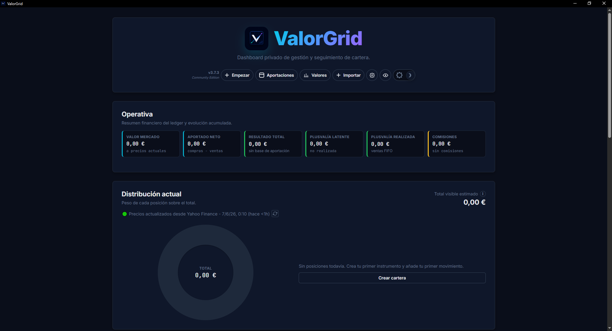
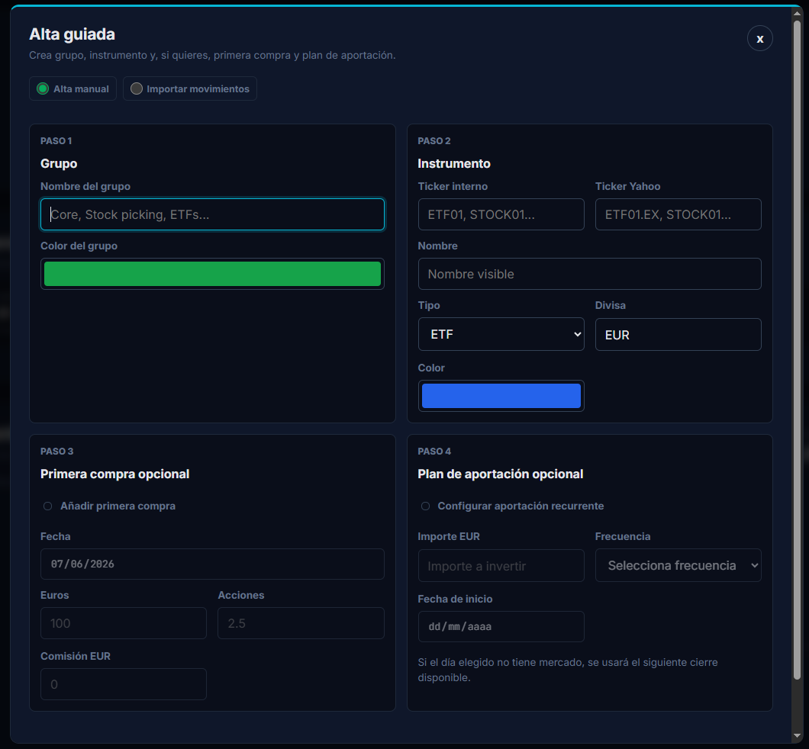
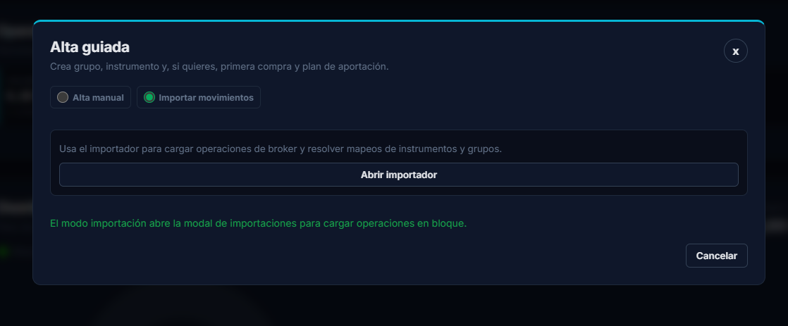
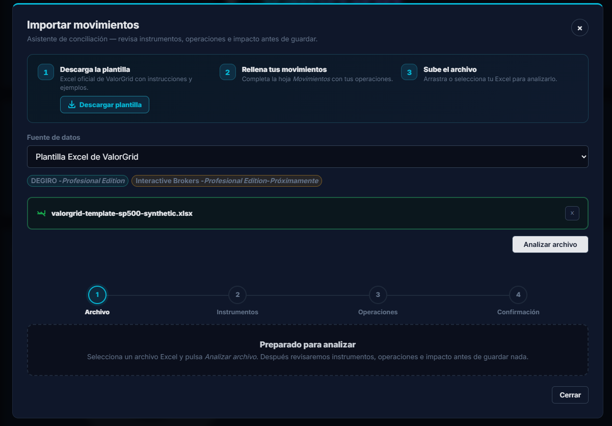
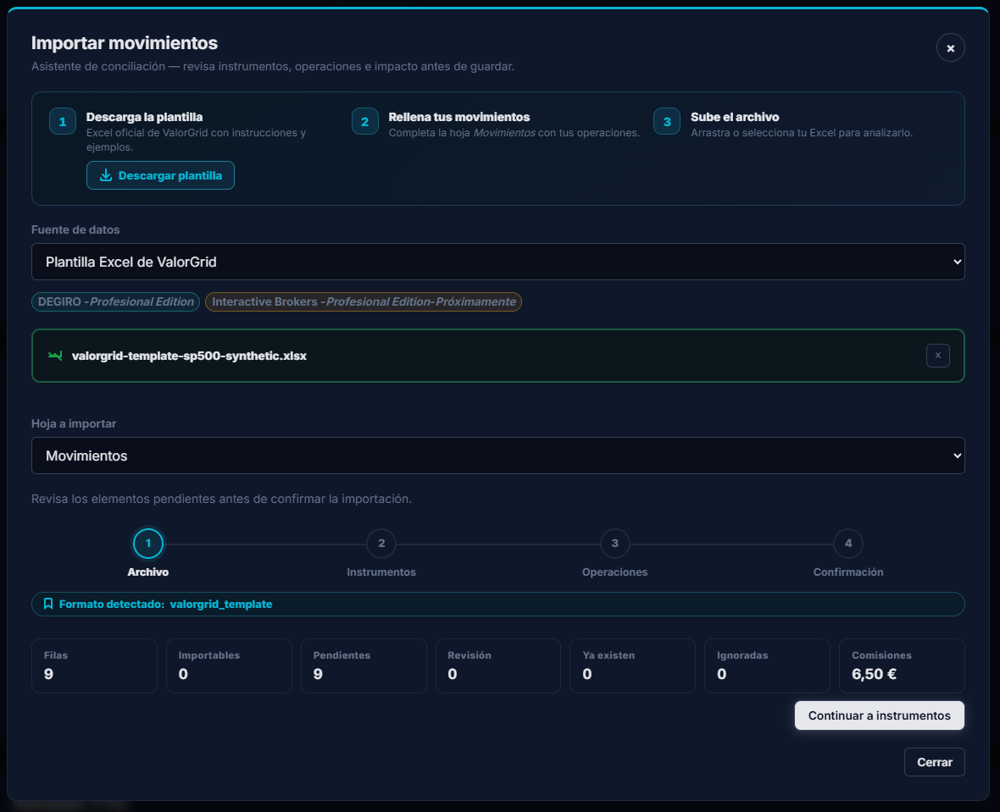
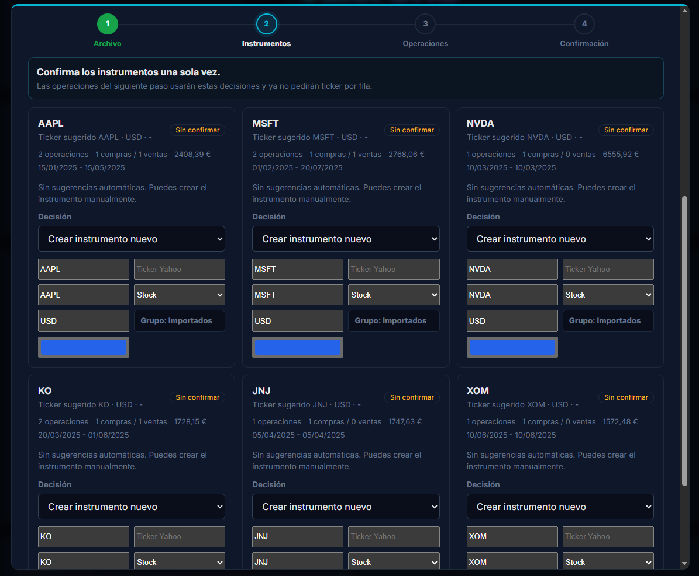
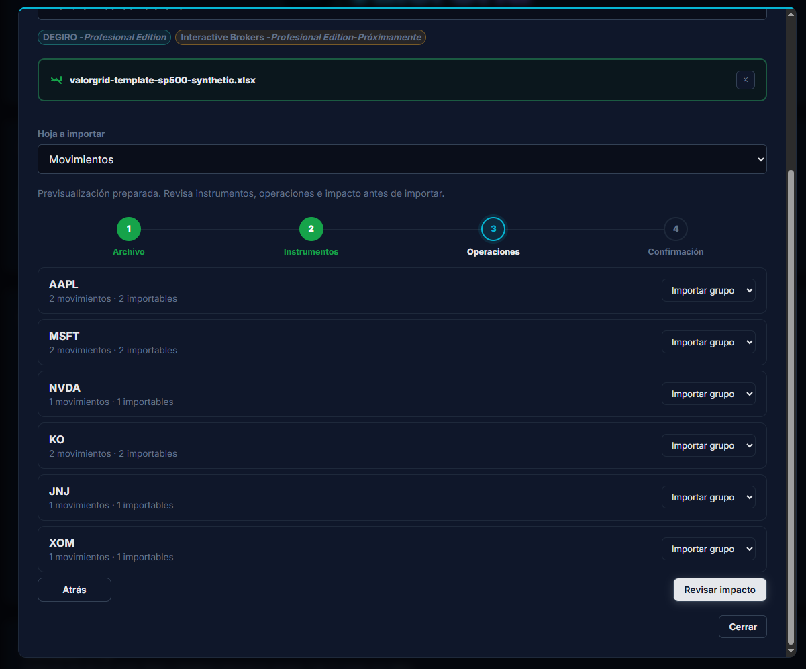
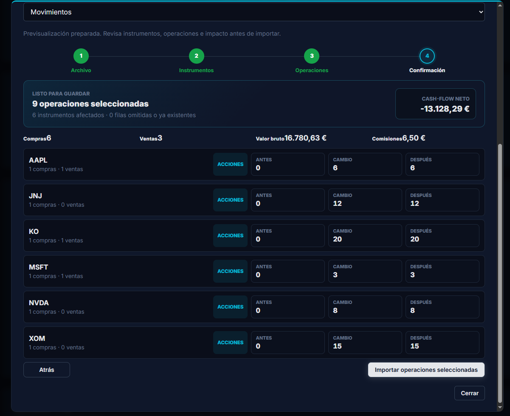

# Primeros Pasos Con ValorGrid

Esta guía está pensada para usuarios que quieren probar ValorGrid sin usar comandos.

## 1. Instala La App

1. Abre la [última release oficial](https://github.com/aivm23/ValorGrid/releases/latest).
2. Descarga `ValorGrid-Setup-X.Y.Z-x64.exe`.
3. Ejecuta el instalador.
4. Abre ValorGrid desde el menú Inicio.

La app guarda la base de datos y los backups en la carpeta privada de datos de tu usuario.

## 2. Conoce El Dashboard

Al abrir ValorGrid verás el dashboard principal con tres secciones:

- **Cabecera** — botones de acción rápida: _Empezar_, _Aportaciones_, _Valores_, _Importar_ y ajustes.
- **Operativa** — resumen financiero del ledger: valor mercado, aportado neto, resultado total, plusvalía latente, plusvalía realizada y comisiones.
- **Distribución actual** — gráfico de dona con el peso de cada posición y el total visible estimado.

Si la instalación está vacía, el dashboard muestra ceros y un botón _Crear cartera_.



## 3. Crea Tu Primera Cartera

Pulsa **+ Empezar** en la cabecera para abrir el asistente de alta guiada.

### Opción A — Alta manual

El asistente muestra cuatro pasos en una sola pantalla:

| Paso                                     | Qué hace                                                                                  |
| ---------------------------------------- | ----------------------------------------------------------------------------------------- |
| **Paso 1 — Grupo**                       | Nombre del grupo y color. Ejemplo: _Cartera principal_.                                   |
| **Paso 2 — Instrumento**                 | Ticker interno, ticker Yahoo, nombre visible, tipo (ETF, Stock, Crypto…), divisa y color. |
| **Paso 3 — Primera compra opcional**     | Fecha, euros, acciones, comisión.                                                         |
| **Paso 4 — Plan de aportación opcional** | Importe EUR, frecuencia (diaria, semanal, bisemanal, mensual) y fecha de inicio.          |



### Opción B — Importar movimientos

Si seleccionas _Importar movimientos_ en la parte superior del asistente, se abre directamente el importador para cargar operaciones en bloque desde un archivo Excel o un export de broker.



Si vas a crear instrumentos con fuentes distintas de Yahoo, consulta [CREATE_INSTRUMENTS.md](CREATE_INSTRUMENTS.md): explica cómo se asigna automáticamente el proveedor según el tipo (Yahoo para ETF/Stock/Crypto, Alpha Vantage para Commodity).

## 4. Importa Desde Excel

Si ya tienes movimientos en una hoja, pulsa **+ Importar** en la cabecera o elige la opción de importación desde el asistente.

### Paso 1 — Subir archivo

El asistente te guía en tres acciones: descargar la plantilla, rellenar la hoja _Movimientos_ y subir el archivo. Selecciona la fuente de datos (Plantilla Excel de ValorGrid) y arrastra o selecciona tu archivo Excel.

Pulsa **Analizar archivo** para que ValorGrid detecte el formato y analice las filas.



Una vez analizado, verás un resumen con el número de filas, movimientos importables, pendientes, existentes, ignorados y comisiones. Pulsa **Continuar a instrumentos**.



### Paso 2 — Confirmar instrumentos

ValorGrid muestra una tarjeta por cada instrumento detectado en el archivo. Para cada uno puedes:

- asignar un instrumento existente o crear uno nuevo;
- confirmar el ticker, nombre, tipo, divisa y grupo de destino.



### Paso 3 — Revisar operaciones

Lista de movimientos agrupados por instrumento con el número de operaciones y un dropdown para decidir qué grupo importar. Pulsa **Revisar impacto** para ver el resumen final.



### Paso 4 — Confirmar importación

Resumen del impacto: operaciones seleccionadas, instrumentos afectados, cash-flow neto, valor bruto y comisiones. Revisa los cambios de acciones (antes → cambio → después) por instrumento y pulsa **Importar operaciones seleccionadas**.



Guía completa: [IMPORT_EXCEL.md](IMPORT_EXCEL.md).

## 5. Añade Movimientos Manuales

También puedes registrar compras y ventas manualmente desde la zona de movimientos.


Cada movimiento puede incluir:

- fecha;
- ticker;
- compra o venta;
- acciones;
- precio;
- divisa;
- FX a EUR;
- comisión.

## 6. Revisa Evolución E Histórico

ValorGrid materializa el histórico para que la lectura sea rápida.


Puedes revisar:

- valor actual;
- aportado neto;
- resultado total;
- evolución YTD;
- distribución por grupos;
- movimientos visibles en la línea temporal.

## 7. Crea Un Backup

Antes de importar muchos datos o actualizar la app, crea un backup desde la interfaz o con:

```bash
npm run db:backup
```

En la app Windows no necesitas ejecutar el comando; puedes usar la acción de backup integrada.

## 8. Qué No Hace ValorGrid

ValorGrid no recomienda compras, ventas ni carteras. No sustituye a tu broker, asesor financiero ni asesor fiscal.

Su objetivo es ayudarte a organizar, revisar y auditar tu información.
